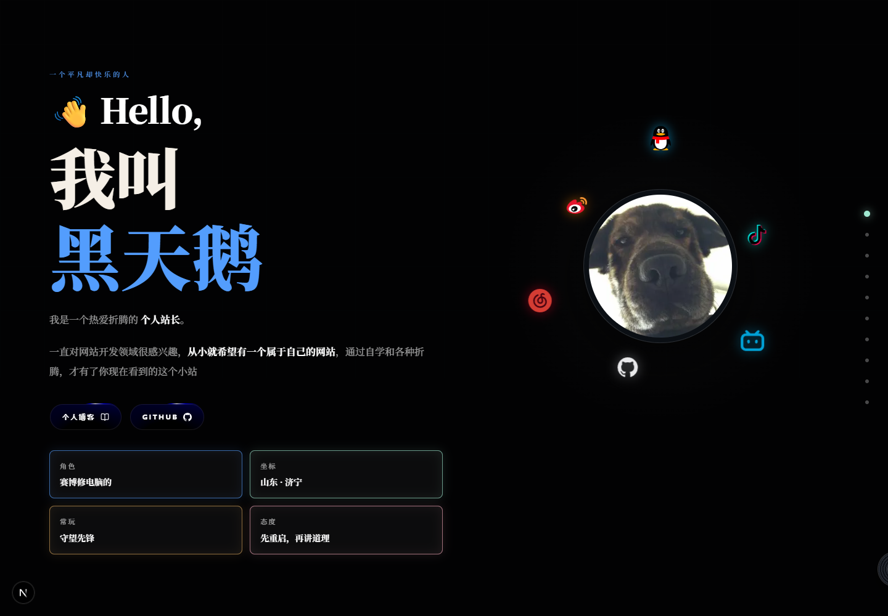
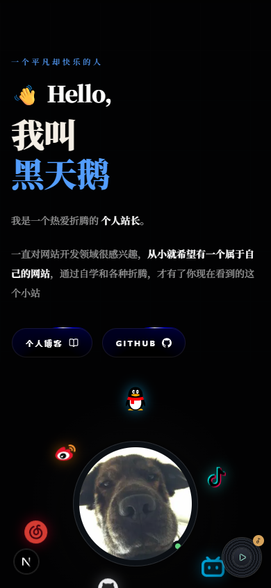

# ithte · 黑天鹅个人主页

<p align="center">
  <strong>一个融合个人档案、音乐可视化、旅行影像与留言互动的响应式个人主页。</strong>
</p>

<p align="center">
  
  
  
  
  
</p>



## 项目简介

`ithte` 是一套可直接二次修改的个人主页源码。页面以深色视觉为基础，通过 GSAP、Motion、OGL/WebGL 和 Web Audio API 构建动态首屏、音乐律动头像、社交图标轨道、照片墙与滚动叙事。

项目内置网易云音乐歌单播放器、二维码登录、逐字歌词、音量和进度控制，并提供一套独立的留言 API，不依赖原项目的第三方业务接口。

## 界面预览

| 桌面端 | 移动端 |
| --- | --- |
|  |  |

## 主要功能

- **响应式个人首页**：桌面端与移动端独立布局，包含首屏档案、位置、故事、旅行、照片墙、留言和人生节点。
- **音乐律动头像**：实时分析响度、低中高频、瞬态与重拍密度，驱动 WebGL 光球、频谱光环及社交图标运动。
- **网易云播放器**：支持歌单读取、上一首/下一首、随机、循环、音量、静音、拖动进度和播放列表。
- **网易云二维码登录**：登录 Cookie 只保存在服务端加密会话中，不进入前端 JavaScript。
- **双排逐字歌词**：支持网易云 YRC 逐字时间、翻译歌词、当前字高亮和动态色彩。
- **多种图片交互**：对角跑马灯、扇形卡片轮播、横向拖动、滚轮切换与自适应灯箱。
- **本地留言 API**：包含文本清洗、敏感词、链接限制、重复检测和 IP 提交频率限制。
- **性能控制**：音乐视觉使用 GPU 渲染，并在离屏、暂停或静止时降低更新开销。
- **SEO 基础配置**：包含 Open Graph、Twitter Card、结构化数据、站点图标与语义化页面结构。

## 技术栈

- [Next.js 16](https://nextjs.org/) / App Router / Standalone Output
- [React 19](https://react.dev/) + TypeScript
- [Tailwind CSS 4](https://tailwindcss.com/) + Sass
- [GSAP](https://gsap.com/) + ScrollTrigger
- [Motion](https://motion.dev/)
- [OGL](https://github.com/oframe/ogl) / WebGL
- Web Audio API
- [NeteaseCloudMusicApi](https://github.com/Binaryify/NeteaseCloudMusicApi)
- Lucide React / React Icons

## 快速启动

### 环境要求

- Node.js `20.9+`
- npm `10+`
- 可访问网易云音乐相关服务的网络环境

### 1. 克隆项目

```bash
git clone https://github.com/ithtelab/ithte.git
cd ithte
```

### 2. 安装依赖

```bash
npm ci
```

开发期间也可以使用 `npm install`。

### 3. 创建本地配置

Windows PowerShell：

```powershell
Copy-Item .env.example .env.local
```

macOS / Linux：

```bash
cp .env.example .env.local
```

本地预览不要求填写网易云 Cookie，可以在播放器中使用二维码登录。

### 4. 启动开发服务器

```bash
npm run dev
```

打开 [http://localhost:3000](http://localhost:3000)。

## 环境变量

| 变量 | 是否必填 | 说明 |
| --- | --- | --- |
| `NEXT_PUBLIC_SITE_URL` | 否 | 生产站点完整地址，用于 canonical 和 Open Graph URL。 |
| `NETEASE_COOKIE` | 否 | 服务端网易云 Cookie。建议优先使用网页二维码登录。 |
| `MUSIC_SESSION_SECRET` | 否 | 网易云登录会话的加密密钥；生产环境建议设置足够长的随机字符串。 |
| `SITE_DATA_DIR` | 否 | 留言和会话密钥的数据目录，默认是项目根目录下的 `data`。 |
| `WALL_BLOCKED_WORDS` | 否 | 留言敏感词，使用英文逗号分隔。 |

任何真实 Cookie、密钥或 Token 都只应写入 `.env.local`，不要提交到 Git。

## 个性化修改

### 基本资料和社交链接

编辑：

```text
src/app/(home)/components/Hero/index.tsx
src/app/layout.tsx
```

这里可以修改昵称、简介、坐标、角色、社交平台地址以及 SEO 元数据。

### 网易云歌单

编辑 `src/components/music-player/netease.ts`：

```ts
export const PLAYLIST_ID = '你的网易云歌单 ID';
```

歌单需要允许当前网易云账号访问。VIP 或付费歌曲仍受账号权限和地区版权限制。

### 图片资源

```text
public/avatar-douyin.jpg   头像
public/photo-wall/         照片墙
public/travel/             旅行画廊
public/milestones/         人生节点
public/social/             社交平台图标
```

替换图片时建议保持原文件名，或者同步修改对应组件的数据配置。

## 常用命令

| 命令 | 用途 |
| --- | --- |
| `npm run dev` | 启动 Turbopack 开发服务器 |
| `npm run lint` | 运行 ESLint |
| `npm run build` | 构建生产版本并整理 Standalone 资源 |
| `npm run start` | 使用 Next.js 启动生产构建 |

## 生产部署

### Node.js / VPS

```bash
npm ci
npm run build
PORT=3000 HOSTNAME=0.0.0.0 node .next/standalone/server.js
```

Windows PowerShell：

```powershell
npm ci
npm run build
$env:PORT = '3000'
$env:HOSTNAME = '0.0.0.0'
node .next/standalone/server.js
```

建议使用 systemd、PM2、Docker 或 1Panel 保持服务运行，并通过 Nginx/Caddy 配置 HTTPS 反向代理。

### 数据持久化

留言、提交频率记录和自动生成的音乐会话密钥默认保存在 `data` 目录。生产环境应将 `SITE_DATA_DIR` 指向持久磁盘并定期备份。

Vercel 等 Serverless 平台的本地文件系统不是持久存储。如果部署到 Serverless，请先把留言存储替换为数据库或 KV 服务。

## 项目结构

```text
ithte/
├─ docs/screenshots/       README 截图
├─ public/                 图片、图标等静态资源
├─ scripts/                Standalone 构建辅助脚本
├─ src/app/                页面、样式和 API Routes
├─ src/components/         音乐播放器与通用组件
├─ src/lib/                留言存储和会话加密
├─ src/utils/              本地资源工具
├─ .env.example            环境变量模板
├─ next.config.ts          Next.js 配置
└─ package.json
```

## 安全与隐私

- 网易云二维码登录使用 HttpOnly Cookie，服务端采用 AES-256-GCM 加密保存会话内容。
- 留言接口包含频率限制、重复内容检测、长度限制和基础输入清洗。
- `.env.local`、运行时 `data`、构建产物和依赖目录均已加入忽略规则。
- 对外部署前请替换个人头像、联系方式、歌单和照片资源。

## 说明

网易云音乐内容及平台图标的权利归各自权利人所有。本项目仅提供个人站点的技术实现，使用时请遵守相关平台条款与当地法律法规。
